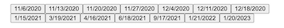
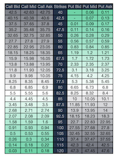

# OptionProfitCalculator
The options profit calculator was built in inspiration of the [Options Profit Calculator](https://www.optionsprofitcalculator.com/). I use this tool often when analyzing stock options to trade. There is only one of these available online that allows you to visualize profits and losses, so I decided to build my own, but better. 

# Options Trading Baiscs
**Definition** : 
If you buy or own a stock option contract it gives you the right, but not the obligation, to buy or sell shares of a stock at a set price on or before a give date (time period). After this date, your contract expires and your option ceases to exist. \
**Types of Options** : 
1.  The **call option** gives its buyer the right, but not the obligation, to "buy" shares of a stock at a specified price on or before a given date. You buy a Call option when you think the price of the underlying stock is going to go up.
2. The **put option** gives its buyer the right, but not the obligation, to "sell" shares of a stock at a specified price on or before a given date. You buy a Put option when you think the price of the underlying stock is going to go down.  

# Black Scholes Model
The Black Scholes Model is the model I use to determine to predicted price of the optionat a given time.

C = Option Price \
S = Stock Price \
K = Strike Price \
r = Risk Interest Rate \
N = A Normal Distribution \
t = Time to Epiration

**Assumptions**
* Stock prices follow lognormal distributions(a stock price cannot be negative)
* Model assumes Implied Volatility is constant
* Brokerage fees are 0 and not taken into consideration

More information on this model can be found [here](https://en.wikipedia.org/wiki/Black%E2%80%93Scholes_model)

# Project Overview 
* Get stock options data from finance API
* Feed Data to Black Scholes Model
* Build matrix displaying profit/loss

# Walkthrough
* User first selects how many 'legs' they want, which depends on their strategy. They then enter the stock ticker, the price is populated and data from API is retrieved.

* User will then press select option button which will display all of the expirations for the current stock options. Once user selects an expiration, a list of all strike prices and options prices will be shown.

* Once User selects the option they want, the fiels are populated and they can finnaly click calculate which will display the grid.
* The grid shows the user the profit or loss at each day until expiration. The y-axis represent the hypothetical stock price and the x-axis shows the date all the way until expiration.

# To-Do:
* Add standard deviations for each option, this will show the user the probability of a stock being in a certain price range
* Add comparisons between two option trades
* Make it more visually appealing

